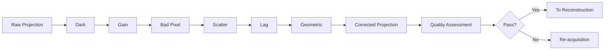

# 2.3 X-ray: Direct Imaging Corrections

## Introduction

Unlike CT scanning, X-ray direct imaging (Digital Radiography, DR) is a projection imaging technique that acquires a 2D projection image with one or a few exposures. Modern X-ray systems predominantly use Flat Panel Detectors (FPDs). These offer high resolution and sensitivity, while introducing specific correction needs that must be addressed in preprocessing.

This chapter dives into the DR preprocessing workflow: detector working principles, detailed algorithms for each correction step, and key differences from CT preprocessing.

### Core Questions

1. How do X-ray flat panel detectors work? What are the pros and cons of different detector types?
2. What correction steps does DR require? What are the physical principles behind each?
3. How does DR preprocessing differ from CT? Why do they require different correction methods?

::: tip DR preprocessing matters
Image quality in DR directly depends on preprocessing. Incomplete corrections can cause artifacts, reduce contrast, and harm diagnostic accuracy.
:::

---

## X-ray Flat Panel Detectors and Signal Acquisition

### Basic Structure of FPDs

Modern DR adopts FPDs composed of an X-ray conversion layer, optical/electrical conversion layer, TFT pixel array, and readout electronics arranged as a 2D matrix. Typical pixel sizes are about 100–200 μm; arrays range from 1k×1k to 4k×4k, corresponding to a 200×200–400×400 mm field of view and real-time imaging at 30–60 fps.

::: info Advantages of FPDs
Compared with film and image intensifiers, FPDs provide higher resolution, lower noise, larger dynamic range, and better real-time performance—dominant in current clinical practice.
:::

### Two Types of Detectors

#### Indirect Conversion Detectors (Scintillator-based)

CsI/CaWO₄ scintillator + a-Si photodiode + TFT: X-rays first convert to visible light in the scintillator; photodiodes then generate charge that is read out via TFTs. Typical detective quantum efficiency is ~60–80%; spatial resolution ~3–5 lp/mm; lower noise and cost, but light spread limits resolution and scintillator afterglow can introduce lag/ghosting.

#### Direct Conversion Detectors (Photoconductor-based)

~200–400 μm a-Se photoconductor + TFT: X-rays directly generate electron–hole pairs in a-Se; under an electric field they drift and are read out by TFTs. DQE can reach ~70–90%; spatial resolution ~5–7 lp/mm; no light spread and sharper imaging, but higher cost, greater temperature sensitivity, and more pronounced lag/charge accumulation issues.

#### Comparison

- Quantum efficiency: Indirect 60–80% vs Direct 70–90%
- Spatial resolution: Indirect 3–5 lp/mm vs Direct 5–7 lp/mm
- Cost: Indirect lower vs Direct higher
- Maturity: Indirect high vs Direct medium
- Lag/ghosting: Indirect moderate vs Direct potentially more visible
- Temperature sensitivity: Indirect low vs Direct high
- Clinical application: Indirect widespread vs Direct in high-end systems

---

## DR Correction Workflow

### Overview

```mermaid
graph TD
    A[Raw Projection Data] --> B[Dark Field Correction]
    B --> C[Gain / Flat Field Correction]
    C --> D[Bad Pixel Correction]
    D --> E[Scatter Correction]
    E --> F[Lag (Ghosting) Correction]
    F --> G[Geometric Distortion Correction]
    G --> H[Corrected Projection Data]
```

::: tip Ordering matters
Dark correction must come first—subsequent steps rely on a correct dark baseline. Gain correction then normalizes pixel response before downstream operations.
:::

---

### Dark Field Correction

Principle: Even with no X-ray exposure, the detector produces a dark signal components from thermal noise, leakage current, electronics noise, and TFT characteristics. If not removed, this forms fixed-pattern noise.

Algorithm for pixel i:

1) Acquire dark references under no X-ray exposure: N_dark frames (typically 10–100)
2) Dark mean:
   I_dark,i = (1/N_dark) Σ_k I_dark,i^(k)
3) Dark standard deviation (for QC):
   σ_dark,i = sqrt((1/N_dark) Σ_k (I_dark,i^(k) − I_dark,i)^2)
4) Apply correction:
   I_corrected,i = I_measured,i − I_dark,i

QC:
- σ_dark,i typically < 1% of mean dark; dark values in reasonable ADU range; spatially smooth distribution
- Update dark template regularly with time/temperature/aging (e.g., daily or post power-up)

::: warning Dark correction is fundamental
Insufficient dark subtraction leaves fixed noise patterns across all images; later steps cannot fully remove this baseline.
:::

---

### Gain / Flat-Field Correction

Principle: Due to manufacturing tolerances and non-uniform beam profiles, pixels respond slightly differently under the same exposure. Gain correction uses a flat-field reference to normalize pixel responses.

Algorithm:

1) Acquire flat-field references: N_flat frames under uniform exposure (conditions close to clinical use)
2) Flat mean:
   I_flat,i = (1/N_flat) Σ_k I_flat,i^(k)
3) Reference intensity (global median or mean):
   I_ref = median(I_flat,i) or I_ref = (1/N_pixel) Σ_i I_flat,i
4) Gain coefficient and correction:
   G_i = I_ref / I_flat,i
   I_corrected,i = (I_measured,i − I_dark,i) × G_i

QC:
- Most G_i concentrated in 0.9–1.1; std < 5%; spatially smooth
- To compensate tube heel effect, modern systems use position-dependent G_i or multiple kVp-specific gain templates

::: tip Practical QC
Flat-field images not only build gain templates but also monitor large-area nonuniformity to detect hardware issues early.
:::

---

### Bad Pixel Correction

Principle: Manufacturing defects or wear introduce abnormal pixels: dead (always 0), hot (abnormally high), stuck (fixed value), noisy (very high variance). If unhandled, these produce bright/dark spots and local artifacts.

Detection strategies:

- Gain-based: if G_i < 0.5 or G_i > 2.0, flag pixel i (thresholds system-dependent)
- Dark noise-based: σ_dark,i > 3 × median(σ_dark) indicates abnormally high noise
- Flat-field stability-based: Var(I_flat,i) > 3 × median(Var(I_flat)) indicates instability

Correction (interpolation):

- Neighborhood mean:
  I_corrected,i = (1/N_neighbors) Σ_{j∈neighbors} I_corrected,j (4/8-neighborhood)
- Weighted interpolation:
  I_corrected,i = (Σ_j w_j I_corrected,j) / (Σ_j w_j), with w_j = 1/d_ij^2
- Bilinear interpolation (on regular grids):
  I_corrected,i,j = (1−α)(1−β) I_{i,j} + α(1−β) I_{i+1,j} + (1−α)β I_{i,j+1} + αβ I_{i+1,j+1}

QC:
- Total bad pixels < 0.1% of all pixels; avoid clustered distribution
- Corrected regions’ intensity and noise should match surroundings
- Track bad pixel count over time; rapid growth suggests maintenance

::: info Practice
Factory calibration initializes bad pixel maps; clinics recheck weekly/monthly. Some high-end systems explore deep learning as an alternative to threshold+interpolation to better preserve diagnostic detail.
:::

---

### Scatter Correction

Principle: Compton-scattered photons in the patient are still detected, elevating measured projection values, reducing contrast, and producing streaks. Simplified as:

p_measured = p_true + p_scatter

Goal: estimate p_scatter and subtract without increasing dose unduly.

Hardware: anti-scatter grid (lead strips + interspaces) to suppress scatter. Typical parameters: strip pitch ~1–2 mm, grid ratio 12:1–16:1, focal distance 100–150 cm. Performance: scatter rejection ~60–80%; primary transmission 70–85%; exposure factor ~1.2–1.5.

Software: estimate a smooth scatter field p_scatter(x,y) via small-aperture collimation measurement, patient-geometry-based Monte Carlo, or CNNs:

p_scatter(x,y) = f(patient geometry, X-ray spectrum, x, y)

Subtract in projection domain:

p_corrected(x,y) = p_measured(x,y) − p_scatter(x,y)

To avoid overcorrection, use a weight α and truncation:

p_corrected(x,y) = max(p_measured(x,y) − α · p_scatter(x,y), 0)

Typical α in 0.5–1.0 depending on system and noise.

Method comparison:

- Anti-scatter grid: 60–80% scatter removal; ~0 ms compute; low complexity; standard DR
- Small-aperture collimation: 70–90%; 100–500 ms; medium complexity; high-precision use
- Monte Carlo: 80–95%; 1–10 s; high complexity; research/special cases
- Machine learning: 85–95%; <100 ms; high complexity; real-time use

::: warning Challenges
Scatter depends on body habitus, field size, kVp, etc. Excessive α or model bias amplifies noise or yields negative projections. Clinical systems cap correction strength and tune via phantom experiments.
:::

---

### Lag (Ghosting) Correction

Principle: Lag refers to residual signal from a prior frame carrying over to subsequent frames—seen as faint ghosting behind moving structures. Sources include scintillator afterglow (CsI: ~μs), a-Se charge traps (ms-scale release), TFT charge/discharge, and readout residual integration.

Typical characteristics:
- Ghosting behind fast motion
- Time dependence: prominent in fluoroscopy
- Residual amplitude: typically 1–5% of prior frame, affecting multiple frames

Models:

- First-order lag:
  I_lag^(n) = α · I_measured^(n−1)
- Second-order lag:
  I_lag^(n) = α · I_measured^(n−1) + β · I_lag^(n−1)
  (α ≈ 0.01–0.05; β ≈ 0.1–0.3)
- Multi-order:
  I_lag^(n) = Σ_{k=1}^K α_k · I_measured^(n−k) (K typically 2–5)

Measurement and correction via alternating black/white frames:

1) Acquire black frames (no X-ray): I_black^(n)
2) Acquire white frames (max X-ray): I_white^(n)
3) Alternate acquisition; residual in black frames:
   I_residual^(n) = I_black^(n) − I_dark
4) First-order parameter:
   α = I_residual^(n) / I_white^(n−1)

Then subtract modeled lag:
I_corrected^(n) = I_measured^(n) − I_lag^(n)

QC:
- α < 5%; otherwise recalibrate or inspect detector
- Residual ghosting < 1% after correction; fluoroscopy contrast improves ~10–20%
- Do not significantly degrade temporal resolution

::: warning Practical notes
Cardiovascular fluoroscopy exhibits strong lag, but precise modeling is difficult. Besides software, high-end systems reduce lag via fast reset circuits, forward biasing of a-Se, and multi-sampling.
:::

---

### Geometric Distortion Correction

Principle: Due to point-source geometry and detector configuration, projections may exhibit barrel/pincushion distortion, radial shift, and tangential skew. Causes include source misalignment, detector tilt, optical nonlinearity, and temperature-induced mechanical deformation. Quantitative measurement/navigation requires correction.

Calibration and modeling:

1) Capture calibration images using checkerboards, dot arrays, or line targets uniformly across the FOV
2) Detect marker positions (edges/corners/circles) to obtain measured coordinates (x_measured, y_measured) and pair with ideal coordinates (x_ideal, y_ideal)
3) Position deviations:
   Δx = x_measured − x_ideal; Δy = y_measured − y_ideal

Fit distortion model from deviations:

- Radial distortion:
  r_corr = r_meas (1 + k1 r_meas^2 + k2 r_meas^4 + k3 r_meas^6 + …)
  where r_meas = sqrt((x_meas − x_c)^2 + (y_meas − y_c)^2)
- Tangential distortion:
  x_corr = x_meas + (p1 (r^2 + 2 x_meas^2) + 2 p2 x_meas y_meas)
  y_corr = y_meas + (p2 (r^2 + 2 y_meas^2) + 2 p1 x_meas y_meas)

Parameters are typically fitted via least squares minimizing Σ_i (Δx_i^2 + Δy_i^2). Using 20–50 well-distributed markers provides sufficient accuracy.

Resampling and QC:

For each pixel (x, y), compute corrected position (x_corr, y_corr), then interpolate (nearest, bilinear, bicubic). Clinical systems often use bilinear interpolation for speed/quality balance.

QC:
- Post-correction grid lines near ideal straightness; residual distortion < 0.5 pixel
- MTF change < 5%; avoid resolution loss
- For quantitative apps (BMD, surgical planning), recalibrate monthly

::: tip Importance
In applications requiring precise measurement (e.g., bone densitometry, surgical navigation), geometric correction is critical—uncorrected distortion causes measurement and localization errors.
:::

---

## Differences Between DR and CT Preprocessing

### Geometry and Acquisition

- Projection geometry: DR uses parallel/point-source projection; CT uses fan/ cone-beam
- Acquisition: DR single/few exposures; CT rotational multi-angle projections
- Detector: DR uses 2D FPD; CT uses 1D or 2D arrays
- Data volume: DR small; CT large
- Temporal resolution: DR high (real time); CT lower (rotation required)
- Spatial resolution: DR high (2D); CT moderate (3D)
- Contrast resolution: DR lower (single projection); CT higher (multi-angle averaging)

### Workflow Comparison

Common steps: dark, gain, bad pixel, scatter corrections.

DR-specific: lag correction; geometric distortion correction.

CT-specific: air calibration; beam hardening correction; ring artifact correction.

Order:

DR: Dark → Gain → Bad Pixel → Scatter → Lag → Geometric

CT: Dark → Gain → Air → Beam Hardening → Scatter → Ring Artifact

### Parameter Differences

- Dark reference: no exposure for both
- Gain reference: uniform exposure for both
- Air calibration: DR not needed; CT needed (no object projection)
- Lag coefficient: 1–5% in DR; N/A in CT
- Geometric distortion: DR requires correction; CT usually compensated by rotation geometry
- Beam hardening: DR not needed (single projection); CT needed (polyenergetic beam through multiple angles)
- Ring artifacts: DR N/A; CT needed

### Complexity and Timing

DR preprocessing is mostly per-pixel, simpler and faster—supports real-time per-frame processing. CT preprocessing must consider projection geometry and polychromatic physics; computation is heavier and often offline/batch, emphasizing inter-angle consistency and beam hardening model accuracy.

Timing reference (indicative):

- Dark/Gain/Bad pixel: <1 ms each (per frame)
- Scatter: 1–100 ms (DR) vs 100–1000 ms (CT)
- Lag: <1 ms (DR) vs N/A (CT)
- Geometric distortion: 10–50 ms (DR) vs N/A (CT)

---

## Data Flow and Quality Control

### Complete Preprocessing Flow



### QC Indicators

- Projection data: SNR > 50 dB; CNR > 10; utilize 12–16 bit dynamic range; artifact level < ~5% of image intensity
- Post-correction: dark residual < 1%; gain nonuniformity < 5%; bad pixel ratio < 0.1%; geometric error < 0.5 pixel

::: tip QC cadence
Routine QC detects system issues early. Clinically, adopt “daily quick checks + weekly detailed evaluation.”
:::

---

## Summary and Next Steps

This chapter covered FPD types and principles, and systematically introduced dark, gain, bad pixel, scatter, lag, and geometric distortion corrections with math and implementation ideas, plus key QC metrics.

Compared to CT’s multi-angle projections and unique issues (beam hardening, ring artifacts), DR emphasizes pixel-level uniformity, lag, and geometric control in single-projection imaging—prioritizing 2D real-time stability.

Calibrated projections proceed to Chapter 3 (reconstruction). Different projection geometries (parallel, fan, cone) map to different algorithms; understanding preprocessing and geometry here benefits subsequent learning.

::: info Next
Before reconstruction, revisit Chapter 1’s projection geometry and this chapter’s data flow—consider how they jointly determine image quality.
:::