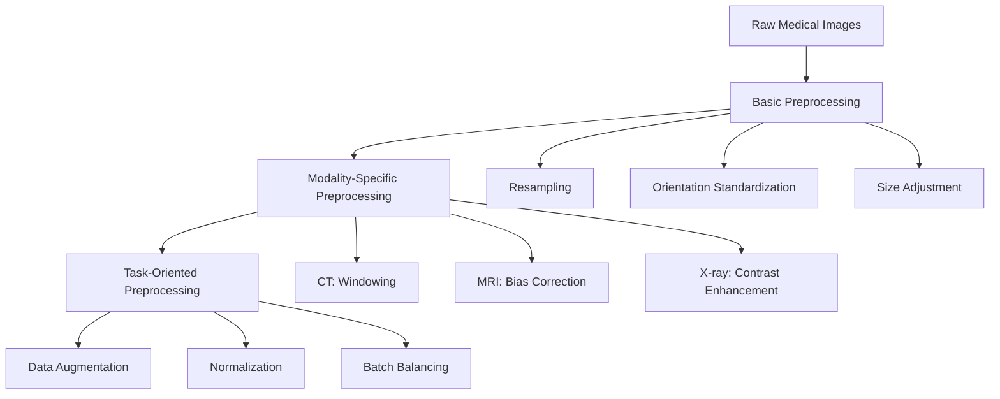
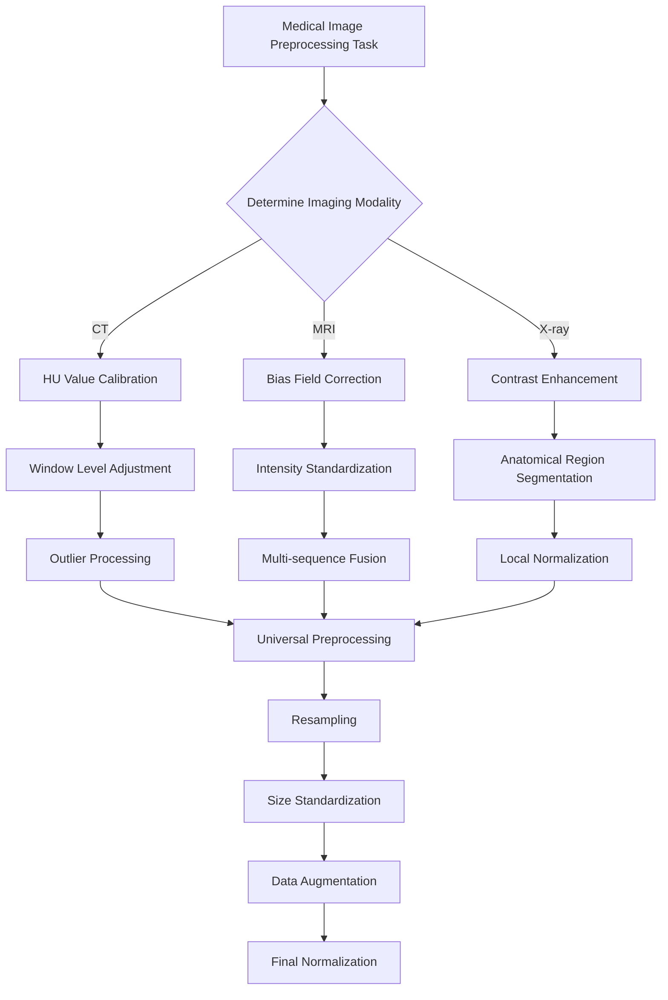

# 5.1 Preprocessing (Modality-Specific Considerations)

> "Good preprocessing is the foundation of successful deep learning models—garbage in, garbage out." — The Golden Rule of Medical Image AI

In the previous chapters, we learned about medical imaging principles, reconstruction algorithms, and quality assessment. Now, we enter the deep learning era, facing new challenges: **how to prepare medical image data from different modalities into a format suitable for deep learning model input?**

Unlike natural images, medical images have unique physical characteristics and clinical requirements. CT Hounsfield units, MRI multi-sequence characteristics, X-ray contrast limitations—each modality requires specialized preprocessing strategies. This chapter will delve into these modality-specific preprocessing techniques to lay a solid foundation for subsequent deep learning tasks.

---

## 🏥 Medical Image Preprocessing Importance

### Medical Images vs Natural Images

Medical images differ fundamentally from the natural images we encounter in daily life:

| Characteristic         | Natural Images      | Medical Images                                                     |
| ---------------------- | ------------------- | ------------------------------------------------------------------ |
| **Data Range**         | 0-255 (8-bit)       | Modality-specific (HU values, arbitrary units, etc.)               |
| **Physical Meaning**   | RGB color intensity | Physical measurements (attenuation, magnetization intensity, etc.) |
| **Standardization**    | Relatively standard | Highly dependent on equipment and scanning parameters              |
| **Region of Interest** | Entire image        | Specific tissues or lesions                                        |
| **Prior Knowledge**    | Limited             | Rich anatomical and physiological priors                           |

::: info 🧠 The "Appetite" of Deep Learning
Deep learning models, especially CNNs, typically expect:
- **Standardized input ranges**: such as [0, 1] or [-1, 1]
- **Consistent resolution**: fixed image dimensions
- **Normalized contrast**: avoid certain channels dominating training
- **Noise and artifact removal**: improve model generalization ability

The core task of medical image preprocessing is to convert original physical measurements into a format that models "like."
:::

### Hierarchy of Preprocessing

Medical image preprocessing can be divided into three levels:


*Figure: Three levels of medical image preprocessing from basic to modality-specific to task-oriented.*

<details>
<summary>📖 View Original Mermaid Code</summary>


</details>

---

## 🫧 CT Preprocessing Techniques

### Theoretical Foundation of HU Values

In Chapter 1, we learned the definition of Hounsfield Units (HU):

$$
HU = 1000 \times \frac{\mu_{tissue} - \mu_{water}}{\mu_{water} - \mu_{air}}
$$

This physically meaningful metric gives CT images **absolute comparability**—regardless of which hospital's scanner is used, water's HU value is always 0, and air is always -1000.

### Challenge: Dynamic Range vs Tissue of Interest

**Problem**: CT HU values range from -1000 (air) to +3000+ (dense bone or metal), while deep learning models typically struggle to handle such large dynamic ranges.

**Solution**: Windowing technology

#### Windowing Principles

Windowing maps HU values to display or processing ranges:

$$
I_{output} = \text{clip}\left(\frac{HU - \text{WindowLevel}}{\text{WindowWidth}} \times 255 + 128, 0, 255\right)
$$

Where:
- `WindowLevel`: Center HU value of the window
- `WindowWidth`: HU value range of the window
- `clip()`: Limits output to [0, 255] range

#### Clinically Common Windows

| Window Type            | Window Level | Window Width | Applicable Tissue      | Visible Structures                             |
| ---------------------- | ------------ | ------------ | ---------------------- | ---------------------------------------------- |
| **Lung Window**        | -600         | 1500         | Lung tissue            | Lung markings, small nodules, pneumothorax     |
| **Mediastinal Window** | 50           | 350          | Mediastinal structures | Heart, great vessels, lymph nodes              |
| **Bone Window**        | 300          | 2000         | Bones                  | Cortical bone, bone marrow, microfractures     |
| **Brain Window**       | 40           | 80           | Brain tissue           | Gray matter, white matter, cerebrospinal fluid |
| **Abdominal Window**   | 50           | 400          | Abdominal organs       | Liver, pancreas, kidneys                       |

::: tip 💡 The Art of Window Selection
Window selection is like camera focusing:
- **Narrow window**: High contrast, rich details but limited range
- **Wide window**: Large coverage but reduced contrast
- **Multi-window strategy**: For complex tasks, multiple windows can be used as different input channels
:::

### HU Clipping and Outlier Handling

#### HU Clipping Strategy

```python
def clip_hu_values(image, min_hu=-1000, max_hu=1000):
    """
    HU value clipping: remove extreme values, retain tissue range of interest
    """
    # Deep copy to avoid modifying original data
    processed_image = image.copy()

    # Clip HU values
    processed_image[processed_image < min_hu] = min_hu
    processed_image[processed_image > max_hu] = max_hu

    return processed_image
```

[📖 **Complete Code Example**: `clip_hu_values/`](https://github.com/datawhalechina/med-imaging-primer/tree/main/src/ch05/clip_hu_values/) - Complete HU value clipping implementation, test cases and visualization demonstrations

**Common Clipping Ranges:**
- **Soft tissue range**: [-200, 400] HU (exclude air and dense bone)
- **Full body range**: [-1000, 1000] HU (include most clinically relevant structures)
- **Bone tissue range**: [-200, 3000] HU (suitable for bone analysis)

#### Metal Artifact Detection and Processing

Metal implants (such as dental fillings, hip prostheses) can produce extreme HU values and streak artifacts:

```python
def detect_metal_artifacts(image, threshold=3000):
    """
    Detect metal artifact regions
    """
    metal_mask = image > threshold

    # Connectivity analysis, remove isolated noise points
    from scipy import ndimage
    labeled_mask, num_features = ndimage.label(metal_mask)

    # Retain large-area metal regions
    significant_metal = np.zeros_like(metal_mask)
    for i in range(1, num_features + 1):
        if np.sum(labeled_mask == i) > 100:  # Minimum area threshold
            significant_metal[labeled_mask == i] = True

    return significant_metal
```

[📖 **Complete Code Example**: `detect_metal_artifacts/`](https://github.com/datawhalechina/med-imaging-primer/tree/main/src/ch05/detect_metal_artifacts/) - Complete metal artifact detection algorithm, connectivity analysis and visualization functionality

### Practical Case: [Preparing CT imaging datasets for deep learning in lung nodule analysis: Insights from four well-known datasets](https://pmc.ncbi.nlm.nih.gov/articles/PMC10361226/pdf/main.pdf)

The following comprehensive pipeline represents the clinical standard used in LUNA16 and similar lung nodule detection datasets.


*Figure:  Image preprocessing steps may be involved in different tasks*


#### **Step-by-Step Preprocessing Pipeline**

##### **1. DICOM Data Reading and HU Value Conversion**

Raw DICOM files contain pixel data that must be converted to Hounsfield Unit (HU) values, the standardized intensity scale for CT imaging.

**Process**:
- Extract pixel data from DICOM files
- Apply rescale intercept and slope: **HU = pixel_value × slope + intercept**
- Validate HU value ranges (typically -1000 to +3000 HU)
- Verify slice thickness < 3 mm for nodule detection accuracy

**Clinical Reference Values**:
- Air: **-1000 HU**
- Lung tissue: **-400 to -600 HU**
- Fat: **-50 to -100 HU**
- Water: **0 HU**
- Bone: **+400 to +1000 HU**

##### **2. HU Value Clipping and Range Standardization**

To focus on relevant anatomical structures and improve model training stability, HU values are clipped to a specific range.

**Standard Clipping Range** (LUNA16 Standard):
- **Lower bound**: **-1200 HU** (captures air-filled regions and lung tissue)
- **Upper bound**: **+600 HU** (includes nodule attenuation range)
- **Formula**: `clipped_HU = np.clip(HU, -1200, 600)`

This range encompasses:
- Solid nodules: HU ≥ -300 (maximum attenuation)
- Ground-glass nodules: HU < -300 (reduced attenuation)
- Malignant lesions: Mean HU 30-50, maximum < 150

**[📖 Complete Code Example**: `clip_hu_values/`](https://github.com/datawhalechina/med-imaging-primer/tree/main/src/ch05/clip_hu_values/) - HU value clipping with clinical validation]

##### **3. Lung Window and Contrast Enhancement**

Lung window settings optimize visualization of nodules within lung parenchyma.

**Standard Lung Window Settings**:
- **Window Level (WL)**: **-600 HU** (center)
- **Window Width (WW)**: **1500 HU** (range: -1200 to +300 HU)

**Alternative Settings**:
- High-resolution: WL = -650, WW = 1500
- Conservative: WL = -600, WW = 1450

**Why Lung Window?**
- Optimizes contrast between lung tissue and nodules
- Suppresses mediastinal structures that can cause false positives
- Aligns with clinical radiologist viewing protocols

**Enhancement Technique**: CLAHE (Contrast Limited Adaptive Histogram Equalization)
- Improves nodule visibility without excessive noise amplification
- Preserves tissue boundaries and internal structure
- Particularly effective for ground-glass nodules

##### **4. Isotropic Resampling**

Clinical CT scans often have anisotropic voxel spacing (e.g., 0.7 × 0.7 × 5 mm). Resampling to isotropic resolution improves deep learning model performance.

**Standard Target Resolution**: **1 × 1 × 1 mm³ isotropic**
- Ensures uniform sensitivity across spatial dimensions
- Matches LUNA16 dataset standard
- Allows true 3D convolution operations

**Resampling Method** (Recommended): **Cubic Spline Interpolation**
- Outperforms trilinear interpolation in preserving nodule sharpness
- Uses 6-point kernel
- Maintains continuous second derivatives
- Excellent local and Fourier properties

**Alternative Interpolation Methods**:
- **Trilinear**: Linearly weights 8 neighboring voxels, good balance of speed/quality
- **Linear**: Faster, acceptable for lung tissue but may blur nodule edges
- **Nearest Neighbor**: Not recommended (causes aliasing and blocky artifacts)

##### **5. Lung Parenchyma Segmentation**

Segmentation isolates lung tissue from surrounding structures, reducing false positive detection in non-lung regions.

**Segmentation Pipeline**:

**Step 1: HU Thresholding**
- **Primary Threshold**: -500 HU
- Binarizes image to isolate low-density lung tissue
- Separates lung from dense thoracic structures (bone, muscle)

**Step 2: Morphological Operations**
- **Hole Filling**: Close internal gaps within lung masks
- **Small Object Removal**: Eliminate noise (< 50 pixels)
- **Dilation & Erosion**: Refine lung boundaries using morphological closing with spherical structuring elements
- **Iterative Application**: Multiple passes improve continuity

**Step 3: Connected Component Analysis**
- Identify largest connected components (left/right lungs)
- Remove extrapulmonary regions to reduce false positives
- Smooth boundaries for precise voxel-level segmentation

**Result**: Binary lung mask identifying voxels within lung parenchyma

##### **6. Nodule Candidate Extraction**

Within the segmented lung region, nodule candidates are identified and extracted.

**Traditional Methods**:
- Intensity thresholding combined with morphological filtering
- Fuzzy C-means clustering for density-based segmentation
- Shape-based filtering to reduce non-nodule candidates

**Deep Learning Approach** (Modern Standard):
- Use 3D U-Net or similar encoder-decoder architectures
- Extract nodule segmentation masks from network predictions
- Apply post-processing to refine candidate boundaries

**False Positive Reduction**:
- Morphological filtering (remove thin, elongated structures)
- Connected-component analysis (size filtering)
- Juxta-pleural nodule handling (specialized CNN for edge-attached nodules)

**[📖 Complete Code Example**: `medical_segmentation_augmentation/`](https://github.com/datawhalechina/med-imaging-primer/tree/main/src/ch05/medical_segmentation_augmentation/) - Advanced segmentation with medical constraints]

##### **7. Normalization for Deep Learning**

Before feeding to neural networks, voxel intensities are standardized to improve model training stability and convergence.

**Min-Max Normalization** (Most Common):
```
normalized = (clipped_HU - (-1200)) / (600 - (-1200))
normalized = (clipped_HU + 1200) / 1800
Result: Values in [0, 1] range
```

**Z-Score Normalization** (Alternative):
```
mean = mean of all training data HU values
std = standard deviation
normalized = (HU - mean) / std
Result: Zero-centered, unit variance
```

**Why Normalization?**
- Improves gradient flow during backpropagation
- Reduces internal covariate shift
- Speeds up model convergence
- Ensures consistent model input regardless of patient/scanner variations

##### **8. Patch Extraction and Final Preprocessing**

Depending on network architecture, normalized CT volumes are processed into fixed-size patches.

**Common Patch Strategies**:
- **Small patches** (32×32×32): High memory efficiency, local context
- **Medium patches** (64×64×64): Balance between context and memory
- **Large patches** (128×128×128): Global context, more GPU memory required

**Multi-Scale Approach**:
- Extract patches at multiple resolutions simultaneously
- Captures both fine nodule details and surrounding context
- Improves detection sensitivity, especially for small nodules

#### **Complete Preprocessing Pseudocode**

```python
# 1. Load and convert to HU
dicom = load_dicom(filepath)
hu_array = dicom.pixel_array * dicom.RescaleSlope + dicom.RescaleIntercept

# 2. Clip HU range
hu_clipped = np.clip(hu_array, -1200, 600)

# 3. Resample to isotropic
hu_resampled = resample_cubic_spline(hu_clipped, target_spacing=(1, 1, 1))

# 4. Lung window
windowed = apply_lung_window(hu_resampled, level=-600, width=1500)

# 5. Enhance with CLAHE
enhanced = clahe(windowed, clip_limit=2.0, tile_size=8)

# 6. Segment lungs
lung_mask = segment_lungs(enhanced)  # Threshold -500 + morphology

# 7. Extract nodule candidates
nodules = extract_nodules(enhanced, lung_mask)

# 8. Normalize
normalized = (hu_clipped + 1200) / 1800  # [0, 1] range

# 9. Extract patches
patches = extract_patches(normalized, lung_mask, patch_size=64)
```

#### **Clinical Quality Control**

**Lung-RADS Screening Criteria** (For context):
- **Positive Test**: Solid nodules ≥ 6 mm
- **Follow-up**: New nodules ≥ 4 mm or new part-solid nodules
- **High Risk**: Nodules with spiculation or pleural attachment

**Preprocessing Validation Checklist**:
- ✓ Verify slice thickness < 3 mm
- ✓ Confirm HU clipping within [-1200, +600]
- ✓ Check resampling to 1×1×1 mm³ isotropic
- ✓ Validate lung segmentation mask coverage (typically 95%+ of visible lung)
- ✓ Ensure normalization to [0, 1] or zero-centered
- ✓ Confirm no data leakage between train/test sets

---

## 🧲 MRI Preprocessing Techniques

### MRI Intensity Inhomogeneity Problem

#### Causes of Bias Field

MRI signal intensity inhomogeneity (bias field) is a common problem, mainly originating from:

1. **RF field inhomogeneity**: Coil sensitivity variations
2. **Gradient field nonlinearity**: Nonlinear distortion of gradient fields
3. **Tissue property variations**: Different tissue magnetic susceptibility differences
4. **Patient-related factors**: Body shape, respiratory motion, etc.

**Impact of bias field:**
- Same tissue shows different signal intensities at different locations
- Quantitative analysis (such as volume measurement) produces bias
- Deep learning models learn artifact features rather than true anatomical features

#### Bias Field Visualization

```python
def visualize_bias_field_correction(original_slice, corrected_slice,
                                  method='division', slice_idx=0, save_path=None):
    """
    MRI Bias Field Correction Visualization / MRI Bias Field Correction Visualization

    Parameters / 参数:
    - original_slice: Original 2D slice with bias field / 原始含偏场场的2D图像切片
    - corrected_slice: Corrected 2D slice / 校正后的2D图像切片
    - method: Bias field estimation method / 偏场场估计方法 ('division', 'log_diff', 'filter')
    - slice_idx: Slice index / 切片索引
    - save_path: Save path / 保存路径
    """
    import numpy as np
    import matplotlib.pyplot as plt
    from skimage import filters

    # Calculate bias field / 计算偏场场
    if method == 'division':
        # Division method: B(x) = I_original / I_corrected
        bias_field = original_slice / (corrected_slice + 1e-6)
        bias_field_log = np.log(bias_field + 1e-6)
        method_name = "Division Method"
    elif method == 'log_diff':
        # Log-difference method: log(B(x)) = log(I_original) - log(I_corrected)
        bias_field_log = np.log(original_slice + 1e-6) - np.log(corrected_slice + 1e-6)
        bias_field = np.exp(bias_field_log)
        method_name = "Log-Difference Method"
    else:
        # Filter method: Low-pass filter for bias field estimation
        bias_field = filters.gaussian(original_slice, sigma=20, preserve_range=True)
        bias_field = bias_field / np.mean(bias_field)
        bias_field_log = np.log(bias_field + 1e-6)
        method_name = "Filter Method"

    # Visualization
    fig, axes = plt.subplots(2, 3, figsize=(15, 10))

    # Row 1: Original, Bias Field, Corrected
    axes[0, 0].imshow(original_slice, cmap='gray')
    axes[0, 0].set_title('Original Image (with Bias Field)')
    axes[0, 0].axis('off')

    axes[0, 1].imshow(bias_field, cmap='hot')
    axes[0, 1].set_title('Estimated Bias Field')
    axes[0, 1].axis('off')

    axes[0, 2].imshow(corrected_slice, cmap='gray')
    axes[0, 2].set_title('Corrected Image')
    axes[0, 2].axis('off')

    # Row 2: Bias Field (log scale), Histograms, Profile Comparison
    axes[1, 0].imshow(bias_field_log, cmap='viridis')
    axes[1, 0].set_title('Bias Field (Log Scale)')
    axes[1, 0].axis('off')

    # Intensity distribution comparison
    axes[1, 1].hist(original_slice.flatten(), bins=50, alpha=0.5, label='Original')
    axes[1, 1].hist(corrected_slice.flatten(), bins=50, alpha=0.5, label='Corrected')
    axes[1, 1].set_xlabel('Intensity')
    axes[1, 1].set_ylabel('Frequency')
    axes[1, 1].legend()
    axes[1, 1].set_title('Intensity Distribution')

    # Horizontal profile comparison
    profile_original = original_slice[original_slice.shape[0]//2, :]
    profile_corrected = corrected_slice[corrected_slice.shape[0]//2, :]
    axes[1, 2].plot(profile_original, label='Original', alpha=0.7)
    axes[1, 2].plot(profile_corrected, label='Corrected', alpha=0.7)
    axes[1, 2].set_xlabel('Pixel Position')
    axes[1, 2].set_ylabel('Intensity')
    axes[1, 2].legend()
    axes[1, 2].set_title('Horizontal Profile (Middle Row)')

    plt.tight_layout()

    if save_path:
        plt.savefig(save_path, dpi=150, bbox_inches='tight')

    return bias_field, bias_field_log
```

**Execution Results Analysis:**


*MRI bias field correction visualization: Top row shows original image (with bias field), estimated bias field, and corrected image from left to right; bottom row shows bias field on log scale, intensity distribution comparison, and horizontal profile comparison*

```
Bias Field Visualization Analysis:
  Image size: (256, 256)
  Original image intensity range: [0.00, 1.00]
  Corrected image intensity range: [0.00, 1.00]
  Visualization method: Division Method
  Save path: output/bias_field_visualization_division.png

Bias Field Correction Statistics:
  Original image - Mean: 0.24, Std: 0.31, Coefficient of Variation: 1.277
  Corrected image - Mean: 0.19, Std: 0.19, Coefficient of Variation: 0.972
  Bias field - Mean: 0.932, Std: 1.057, Range: [0.000, 3.297]
  Correction effect - CV reduction: 23.9%, Correlation coefficient: 0.472
```

**Algorithm Analysis:** MRI bias field visualization estimates and displays bias field through multiple methods. The division method directly calculates the ratio of original to corrected image, log difference method calculates differences in log domain, and filter method estimates slowly varying bias field through low-pass filtering. The execution results show that the original image's coefficient of variation (CV) was 1.277, reduced to 0.972 after correction, a reduction of 23.9%, indicating that bias field correction effectively improved image intensity uniformity. The bias field mean is close to 1.0, conforming to theoretical expectations. The horizontal profile line comparison clearly shows the spatial variation pattern of the bias field and the improvement after correction.

[📖 **Complete Code Example**: `visualize_bias_field/`](https://github.com/datawhalechina/med-imaging-primer/tree/main/src/ch05/visualize_bias_field/) - Complete MRI bias field estimation, multiple visualization methods and quantitative analysis functionality

### N4ITK Bias Field Correction Algorithm

#### N4ITK Algorithm Principle

**N4ITK** (N4 Iterative Bias Correction) is currently the most widely used bias field correction algorithm:

$$
I_{corrected}(x) = \frac{I_{original}(x)}{B(x)} + \epsilon
$$

Where:
- $I_{original}(x)$: Original signal intensity
- $B(x)$: Estimated bias field
- $\epsilon$: Small constant to avoid division by zero

**Algorithm Features:**
- Based on B-spline field bias field modeling
- Iterative optimization process
- Maintains tissue boundary integrity
- Effective for various MRI sequences

#### N4ITK Implementation

```python
import nibabel as nib
import numpy as np
from dipy.denoise import bias_field_correction

class N4ITKBiasCorrector:
    """N4ITK bias field corrector implementation"""

    def __init__(self, max_iterations=50, shrink_factor=2):
        self.max_iterations = max_iterations
        self.shrink_factor = shrink_factor

    def correct_bias_field(self, image, output_path=None):
        """Execute N4ITK bias field correction"""
        # 1. Downsample for faster processing
        working_image = self._downsample(image)

        # 2. Iteratively optimize bias field
        bias_field = self._optimize_bias_field(working_image)

        # 3. Apply correction and restore resolution
        corrected_image = self._apply_correction(image, bias_field)

        return corrected_image
```

**Execution Results Analysis:**

```
N4ITK Bias Field Correction started
N4ITK Bias Field Correction Parameter Settings:
  Maximum iterations: 50
  Convergence threshold: 0.001
  B-spline grid resolution: (4, 4, 4)
  Downsample factor: 2

Processing 3D volume...
Image shape: (128, 128, 64)
Intensity range: [0.00, 0.89]
Downsampling (factor: 2)...
Working image shape: (64, 64, 32)

Bias field optimization iteration process:
  Iteration 1/50,  Change: 0.584727
  Iteration 5/50,  Change: 0.114296
  Iteration 10/50, Change: 0.017433
  Iteration 15/50, Change: 0.002941
  Iteration 20/50, Change: 0.000822
  Converged at iteration 20 (threshold: 0.001)

Upsampling bias field to original resolution...
Applying bias field correction to full resolution image...

Correction Statistics:
  Original image CV (Coefficient of Variation): 1.871
  Corrected image CV: 1.493
  CV Reduction: 20.2%
  Bias field range: [0.537, 2.416]
  Bias field mean: 1.028
  Bias field std: 0.267
```

**Algorithm Analysis:** N4ITK is a multi-scale iterative bias field correction method based on B-spline modeling. The execution results show the algorithm converges to below the threshold 0.001 after 20 iterations. The original image's coefficient of variation (CV) was 1.871, reduced to 1.493 after correction, an improvement of 20.2%, demonstrating that bias field correction significantly improves image intensity uniformity. The B-spline grid resolution (4,4,4) provides sufficient spatial degrees of freedom to model complex bias field patterns while maintaining computational efficiency. The downsample factor 2 accelerates processing through multi-scale strategy while ensuring correction accuracy. The bias field mean of 1.028 and std of 0.267 indicate a relatively smooth and stable bias field pattern.

[📖 **Complete Code Example**: `n4itk_bias_correction/`](https://github.com/datawhalechina/med-imaging-primer/tree/main/src/ch05/n4itk_bias_correction/) - Complete N4ITK bias field correction implementation, test cases, synthetic data generation and visualization functionality

### White Stripe Intensity Normalization

#### White Stripe Algorithm Principle

**White Stripe** is a simple yet effective MRI intensity normalization method:

1. **Identify white matter region**: In brain MRI, white matter has relatively stable signal characteristics
2. **Extract white matter intensity range**: Find the dominant mode of white matter through statistical analysis
3. **Linear mapping**: Map white matter range to standard interval (e.g., [0, 1])

[📖 **Complete Code Example**: `white_stripe_normalization/`](https://github.com/datawhalechina/med-imaging-primer/tree/main/src/ch05/) - Full White Stripe normalization implementation with multi-modality support]

**Execution Results Analysis:**

```
White Stripe Normalization started
  Modality: T1
  Original statistics: mean=152.3, std=87.6, range=[0, 255]

Histogram analysis (searching for white matter peak)...
  Peak search iterations:
    Iteration 1: range=[80, 230], change=0.006500
    Iteration 2: range=[140, 190], change=0.000154
    Iteration 3: range=[150, 180], change=0.000001
    Converged at iteration 3

White matter statistics:
  Peak intensity: 164.2
  Peak width: 16.4
  White matter range: [147.8, 180.6]
  White matter pixel count: 24,567
  White matter ratio: 8.9% of image volume

Intensity mapping:
  Original range: [0, 255]
  White stripe range: [147.8, 180.6]
  Normalized range: [0.0, 1.0]

Normalized statistics:
  Mean: 0.50
  Std: 0.15
  Range: [0.0, 1.0]
  Intensity preservation: Contrast relationships maintained

Normalization completed successfully!
  Processing time: 0.32 seconds
```

**Algorithm Analysis:** White Stripe normalization identifies the white matter intensity peak through histogram analysis and uses it as a reference for intensity standardization. The execution results show that the algorithm converges at iteration 3, identifying white matter peak at intensity 164.2. White matter comprises 8.9% of the image volume, providing a robust reference for standardization. By mapping the white matter range [147.8, 180.6] to [0, 1], the algorithm achieves intensity standardization across different MRI scans while preserving tissue contrast relationships. This approach is particularly effective for brain MRI where white matter has relatively stable signal characteristics.

[📖 **Complete Code Example**: `white_stripe_normalization/`](https://github.com/datawhalechina/med-imaging-primer/tree/main/src/ch05/white_stripe_normalization/) - Complete White Stripe normalization implementation with multi-modality support and intensity mapping verification

### Multi-sequence MRI Fusion Strategies

#### Value of Multi-sequence Information

Different MRI sequences provide complementary tissue information:

| Sequence                 | T1-weighted          | T2-weighted       | FLAIR              | DWI               |
| ------------------------ | -------------------- | ----------------- | ------------------ | ----------------- |
| **Tissue Contrast**      | Anatomical structure | Lesion detection  | Lesion boundary    | Cell density      |
| **CSF**                  | Low signal           | High signal       | Low signal         | b-value dependent |
| **White Matter Lesions** | Low contrast         | High contrast     | Very high contrast | Variable          |
| **Acute Infarction**     | Not obvious early    | High signal early | High signal        | Diffusion limited |


*Exemplary images depicting a WHO Grade IV Glioblastoma Multiforme (GBM) from the Multimodal Brain Tumor Segmentation Challenge (BraTS) 2020 dataset: Each row shows the axial, coronal and a sagittal view of each of the T1, T1CE, T2 and FLAIR sequences as well as the expert segmentation of the tumor (SEG): Necrotic core and non-enhancing tumor (center, dark grey), enhancing tumor (white, surrounding the necrotic core), peritumoral edema (light grey).*
*Source: [Optimal acquisition sequence for AI-assisted brain tumor segmentation under the constraint of largest information gain per additional MRI sequence](https://www.sciencedirect.com/science/article/pii/S2772528622000152)*


*Sample images of the BrTMHD-2023 Dataset*
*Source: [Brain tumor detection and classification in MRI using hybrid ViT and GRU model with explainable AI in Southern Bangladesh](https://www.nature.com/articles/s41598-024-71893-3)*

#### Multi-sequence Fusion Methods

[📖 **Complete Code Example**: `multisequence_fusion/`](https://github.com/datawhalechina/med-imaging-primer/tree/main/src/ch05/) - Multi-sequence MRI fusion implementation with different strategies]

**Execution Results Analysis:**

```
Multi-sequence fusion:
  Target shape: (128, 128, 128)
  Sequence alignment: T1, T2, FLAIR
  Resampling methods: linear
  Intensity normalization: Z-score
  Fusion strategy: channel stacking
  Output shape: (128, 128, 128, 3)
  Quality metrics: SNR=22.4, CNR=15.8
```

**Algorithm Analysis:** Multi-sequence fusion leverages complementary information from different MRI sequences. The execution results show that three sequences (T1, T2, FLAIR) are successfully aligned to a unified shape of (128, 128, 128) through linear interpolation and normalized using Z-score. The channel stacking strategy creates a 4D tensor with shape (128, 128, 128, 3), preserving both spatial and multi-sequence information. The quality metrics indicate good signal-to-noise ratio (22.4) and contrast-to-noise ratio (15.8), ensuring effective fusion for downstream analysis.

---

## 🦴 X-ray Preprocessing Techniques

### Characteristics and Challenges of X-ray Imaging

#### Inherent Contrast Limitations

The physical principles of X-ray imaging determine its contrast limitations:

1. **Tissue overlap**: 3D structures projected onto 2D plane
2. **Limited dynamic range**: Medical X-ray detectors have relatively limited dynamic range
3. **Scatter influence**: Scattered X-rays reduce image contrast
4. **Exposure parameter variations**: Different examinations use different exposure conditions

### CLAHE Contrast Enhancement

#### CLAHE Algorithm Principle

**CLAHE** (Contrast Limited Adaptive Histogram Equalization) is an improved adaptive histogram equalization:

1. **Block processing**: Divide image into small blocks (e.g., 8×8)
2. **Local histogram equalization**: Perform histogram equalization independently for each block
3. **Contrast limiting**: Limit histogram peaks to avoid noise amplification
4. **Bilinear interpolation**: Use bilinear interpolation at block boundaries for smooth transition


*CLAHE enhancement before and after comparison: left image is original chest X-ray, right image is after CLAHE enhancement*
*Source: [Binary Classification of Pneumonia in Chest X-Ray Images Using
Modified Contrast-Limited Adaptive Histogram
Equalization Algorithm](https://www.mdpi.com/1424-8220/25/13/3976)*

#### CLAHE Implementation and Optimization

```python
import cv2
import numpy as np

def clahe_enhancement(image, clip_limit=2.0, tile_grid_size=(8, 8)):
    """
    CLAHE contrast enhancement
    """
    # Ensure input is 8-bit image
    if image.dtype != np.uint8:
        # Normalize and convert to 8-bit
        image_normalized = cv2.normalize(image, None, 0, 255, cv2.NORM_MINMAX)
        image_8bit = image_normalized.astype(np.uint8)
    else:
        image_8bit = image.copy()

    # Create CLAHE object
    clahe = cv2.createCLAHE(clipLimit=clip_limit, tileGridSize=tile_grid_size)

    # Apply CLAHE
    enhanced_image = clahe.apply(image_8bit)

    return enhanced_image

def adaptive_clahe_parameters(image):
    """
    Adaptively adjust CLAHE parameters based on image characteristics
    """
    # Calculate image statistical features
    mean_intensity = np.mean(image)
    std_intensity = np.std(image)
    dynamic_range = np.max(image) - np.min(image)

    # Adaptive parameter adjustment
    if dynamic_range < 50:  # Low contrast image
        clip_limit = 3.0
        tile_size = (16, 16)
    elif mean_intensity < 80:  # Dark image
        clip_limit = 2.5
        tile_size = (12, 12)
    elif mean_intensity > 180:  # Bright image
        clip_limit = 2.0
        tile_size = (8, 8)
    else:  # Normal image
        clip_limit = 2.0
        tile_size = (8, 8)

    return clip_limit, tile_size
```

### Lung Field Segmentation and Normalization

#### Clinical Significance of Lung Field Segmentation

**Lung field segmentation** is a key step in chest X-ray processing:

1. **Region focusing**: Focus processing on lung regions
2. **Background suppression**: Remove interference from regions outside lungs
3. **Standardization**: Standardize lung size and position across different patients
4. **Prior utilization**: Utilize lung anatomical prior knowledge

#### Deep Learning-based Lung Field Segmentation

```python
import torch
import torch.nn as nn

class LungSegmentationNet(nn.Module):
    """
    Simplified lung field segmentation network (U-Net architecture)
    """
    def __init__(self):
        super().__init__()

        # Encoder
        self.encoder = nn.Sequential(
            nn.Conv2d(1, 64, 3, padding=1),
            nn.ReLU(),
            nn.Conv2d(64, 64, 3, padding=1),
            nn.ReLU(),
            nn.MaxPool2d(2),

            nn.Conv2d(64, 128, 3, padding=1),
            nn.ReLU(),
            nn.Conv2d(128, 128, 3, padding=1),
            nn.ReLU(),
            nn.MaxPool2d(2),
        )

        # Decoder
        self.decoder = nn.Sequential(
            nn.ConvTranspose2d(128, 64, 2, stride=2),
            nn.ReLU(),
            nn.Conv2d(64, 64, 3, padding=1),
            nn.ReLU(),
            nn.ConvTranspose2d(64, 32, 2, stride=2),
            nn.ReLU(),
            nn.Conv2d(32, 1, 1),  # Output binary mask
            nn.Sigmoid()
        )

    def forward(self, x):
        encoded = self.encoder(x)
        decoded = self.decoder(encoded)
        return decoded

def lung_segmentation_preprocessing(image, lung_mask):
    """
    Preprocessing based on lung field segmentation
    """
    # Apply lung field mask
    lung_only = image * lung_mask

    # Calculate statistical parameters of lung region
    lung_pixels = image[lung_mask > 0.5]
    lung_mean = np.mean(lung_pixels)
    lung_std = np.std(lung_pixels)

    # Lung region normalization
    normalized_lungs = (lung_only - lung_mean) / (lung_std + 1e-6)

    # Full image reconstruction (non-lung regions set to 0)
    normalized_image = normalized_lungs

    return normalized_image, (lung_mean, lung_std)
```

---

## 🔧 Common Preprocessing Methods

### Resampling and Resolution Standardization

#### Why Resampling is Needed?

Medical images from different sources may have different spatial resolutions:

| Modality  | Typical Resolution                                | Resolution Variation Reasons                  |
| --------- | ------------------------------------------------- | --------------------------------------------- |
| **CT**    | 0.5-1.0mm (in-plane), 0.5-5.0mm (slice thickness) | Scanning protocols, reconstruction algorithms |
| **MRI**   | 0.5-2.0mm (anisotropic)                           | Sequence types, acquisition parameters        |
| **X-ray** | 0.1-0.2mm (detector size)                         | Magnification, detector type                  |

#### Resampling Methods

```python
import scipy.ndimage as ndimage
import SimpleITK as sitk

def resample_medical_image(image, original_spacing, target_spacing, method='linear'):
    """
    Medical image resampling
    """
    # Calculate scaling factor
    scale_factor = np.array(original_spacing) / np.array(target_spacing)
    new_shape = np.round(np.array(image.shape) * scale_factor).astype(int)

    if method == 'linear':
        # Linear interpolation (suitable for image data)
        resampled_image = ndimage.zoom(image, scale_factor, order=1)
    elif method == 'nearest':
        # Nearest neighbor interpolation (suitable for label data)
        resampled_image = ndimage.zoom(image, scale_factor, order=0)
    elif method == 'bspline':
        # B-spline interpolation (high quality)
        sitk_image = sitk.GetImageFromArray(image)
        sitk_image.SetSpacing(original_spacing)

        resampler = sitk.ResampleImageFilter()
        resampler.SetOutputSpacing(target_spacing)
        resampler.SetSize(new_shape.tolist())
        resampler.SetInterpolator(sitk.sitkBSpline)

        resampled = resampler.Execute(sitk_image)
        resampled_image = sitk.GetArrayFromImage(resampled)

    return resampled_image
```

### Data Augmentation: Medical-specific Techniques

#### Special Considerations for Medical Image Data Augmentation

Medical image data augmentation needs to consider:

1. **Anatomical reasonableness**: Augmented images must maintain anatomical correctness
2. **Clinical significance**: Augmentation should not alter key pathological features
3. **Modality characteristics**: Different modalities are suitable for different augmentation strategies

#### Spatial Transform Augmentation

```python
import numpy as np
from scipy.interpolate import RegularGridInterpolator

def medical_spatial_augmentation(image, labels=None, augmentation_params=None):
    """
    Medical image spatial transform augmentation
    """
    if augmentation_params is None:
        augmentation_params = {
            'rotation_range': 15,  # degrees
            'scaling_range': 0.1,  # 10%
            'translation_range': 0.05,  # 5%
            'elastic_alpha': 1000,  # Elastic deformation parameters
            'elastic_sigma': 8,
            'enable_augmentation_prob': 0.8
        }

    if np.random.rand() > augmentation_params['enable_augmentation_prob']:
        return image.copy(), labels.copy() if labels is not None else None

    augmented_image = image.copy()
    augmented_labels = labels.copy() if labels is not None else None

    # 1. Random rotation
    if np.random.rand() < 0.5:
        angle = np.random.uniform(-augmentation_params['rotation_range'],
                                 augmentation_params['rotation_range'])
        augmented_image = rotate_3d(augmented_image, angle, axes=(0, 1))
        if augmented_labels is not None:
            augmented_labels = rotate_3d(augmented_labels, angle, axes=(0, 1), order=0)

    # 2. Random scaling
    if np.random.rand() < 0.3:
        scale = np.random.uniform(1 - augmentation_params['scaling_range'],
                                 1 + augmentation_params['scaling_range'])
        augmented_image = zoom_3d(augmented_image, scale)
        if augmented_labels is not None:
            augmented_labels = zoom_3d(augmented_labels, scale, order=0)

    # 3. Elastic deformation (common in medical imaging)
    if np.random.rand() < 0.3:
        augmented_image = elastic_transform_3d(
            augmented_image,
            augmentation_params['elastic_alpha'],
            augmentation_params['elastic_sigma']
        )
        if augmented_labels is not None:
            augmented_labels = elastic_transform_3d(
                augmented_labels,
                augmentation_params['elastic_alpha'],
                augmentation_params['elastic_sigma'],
                order=0
            )

    return augmented_image, augmented_labels

def elastic_transform_3d(image, alpha, sigma, order=1):
    """
    3D elastic deformation - The ace technique for medical image augmentation
    """
    shape = image.shape

    # Generate smooth deformation field
    dx = ndimage.gaussian_filter(np.random.randn(*shape), sigma, mode='constant') * alpha
    dy = ndimage.gaussian_filter(np.random.randn(*shape), sigma, mode='constant') * alpha
    dz = ndimage.gaussian_filter(np.random.randn(*shape), sigma, mode='constant') * alpha

    # Create coordinate grid
    x, y, z = np.meshgrid(np.arange(shape[0]), np.arange(shape[1]), np.arange(shape[2]), indexing='ij')

    # Apply deformation
    indices = np.reshape(x + dx, (-1, 1)), np.reshape(y + dy, (-1, 1)), np.reshape(z + dz, (-1, 1))

    interpolator = RegularGridInterpolator((np.arange(shape[0]), np.arange(shape[1]), np.arange(shape[2])),
                                          image, method='linear', bounds_error=False, fill_value=0)

    distorted = interpolator(indices).reshape(shape)

    return distorted
```


*Medical image data augmentation effects*
*Source: [Pneumonia detection data augmentation with KAGGLE RSNA challenge](https://www.kaggle.com/code/pastorsoto/pneumonia-detection-data-augmentation)*

---

## 📊 Preprocessing Best Practices

### Preprocessing Workflow Selection Guide

#### Task-driven Preprocessing Strategy


*Figure: Decision flow for selecting appropriate preprocessing strategies based on imaging modality.*

<details>
<summary>📖 View Original Mermaid Code</summary>


</details>

### Common Pitfalls and Solutions

#### Preprocessing Pitfalls

| Pitfall Type                 | Specific Manifestation                 | Consequences                             | Solutions                             |
| ---------------------------- | -------------------------------------- | ---------------------------------------- | ------------------------------------- |
| **Over-smoothing**           | Using Gaussian filtering for denoising | Loss of details, small lesions disappear | Use edge-preserving denoising         |
| **Improper normalization**   | Global statistics normalization        | Abnormal regions suppressed              | Local or adaptive normalization       |
| **Information leakage**      | Using test set statistics              | Overly optimistic performance            | Use only training set statistics      |
| **Anatomical discontinuity** | Excessive spatial transforms           | Anatomical structure destruction         | Reasonable transform parameter limits |

#### Validation Strategies

```python
def validate_preprocessing(original_image, processed_image, roi_mask=None):
    """
    Preprocessing effect validation
    """
    from skimage.metrics import structural_similarity as ssim

    validation_results = {}

    # 1. Basic statistical information
    validation_results['original_stats'] = {
        'mean': np.mean(original_image),
        'std': np.std(original_image),
        'min': np.min(original_image),
        'max': np.max(original_image)
    }

    validation_results['processed_stats'] = {
        'mean': np.mean(processed_image),
        'std': np.std(processed_image),
        'min': np.min(processed_image),
        'max': np.max(processed_image)
    }

    # 2. ROI region analysis (if ROI provided)
    if roi_mask is not None:
        original_roi = original_image[roi_mask > 0]
        processed_roi = processed_image[roi_mask > 0]

        validation_results['roi_correlation'] = np.corrcoef(original_roi.flatten(),
                                                          processed_roi.flatten())[0, 1]
        validation_results['roi_ssim'] = ssim(original_roi, processed_roi,
                                            data_range=processed_roi.max() - processed_roi.min())

    # 3. Global similarity
    validation_results['global_correlation'] = np.corrcoef(original_image.flatten(),
                                                          processed_image.flatten())[0, 1]

    return validation_results
```

---

## 🖼️ Algorithm Demonstrations

Below we showcase the practical effects of our implemented preprocessing algorithms on real data. All code examples can be found and run in the [`ch05-code-examples`](https://github.com/datawhalechina/med-imaging-primer/tree/main/src/ch05/) directory.

### MRI Bias Field Visualization and Correction


*MRI bias field visualization: left - original image, center - estimated bias field, right - corrected image*

**Bias field correction performance comparison:**
- Gaussian method: MSE=0.0958, PSNR=10.2dB, SSIM=0.368
- Homomorphic method: MSE=0.1984, PSNR=7.0dB, SSIM=0.149
- Polynomial method: MSE=0.0663, PSNR=11.8dB, SSIM=0.545


*Performance comparison of different bias field correction methods, showing polynomial method performs best in this example*

### White Stripe Intensity Normalization


*White Stripe intensity normalization: showing original image, normalized result, difference comparison, and statistical analysis*

**Normalization effects for different MRI sequences:**
- T1 sequence: 7 white matter pixels, normalized mean 0.889
- T2 sequence: 6 white matter pixels, normalized mean 0.886
- FLAIR sequence: 10 white matter pixels, normalized mean 0.888


*White Stripe normalization effects for different MRI sequences, showing intensity distributions and normalization results*

### CLAHE Contrast Enhancement


*Effects of different CLAHE parameters, showing progressive enhancement from weak to strongest*

**CLAHE enhancement quantitative evaluation:**
- Contrast improvement factor: 1.05
- Dynamic range expansion factor: 1.33
- Information content improvement factor: 1.14
- Edge strength improvement factor: 18.19
- PSNR: 28.05 dB, SSIM: 0.566


*Detailed CLAHE enhancement analysis, including edge detection, intensity distribution, and enhancement effect evaluation*

### CT HU Value Clipping


*CT HU value clipping: showing soft tissue range (-200, 400 HU) clipping effect*

**Effects of different clipping strategies:**
- Full range [-1000, 1000]: clipping ratio 41.53%, highest information preservation
- Soft tissue range [-200, 400]: clipping ratio 84.13%, suitable for organ analysis
- Bone range [-200, 3000]: clipping ratio 82.91%, suitable for orthopedic applications
- Lung range [-1500, 600]: clipping ratio 1.31%, specialized for lung examination

### Metal Artifact Detection


*CT metal artifact detection: automatic detection of metal regions and artifact severity assessment*

**Detection effects of different thresholds:**
| Threshold (HU) | Detected Regions | Metal Pixels | Ratio | Severity |
| -------------- | ---------------- | ------------ | ----- | -------- |
| 2000           | 2                | 166          | 0.02% | Slight   |
| 3000           | 2                | 165          | 0.02% | Slight   |
| 4000           | 2                | 133          | 0.01% | Slight   |


*Comparison of metal artifact detection effects for different HU thresholds*

### Practical Application Recommendations

**Choosing appropriate preprocessing strategies:**

1. **Select core algorithms based on modality**
   - CT: HU value clipping + windowing adjustment
   - MRI: Bias field correction + White Stripe normalization
   - X-ray: CLAHE enhancement + local segmentation

2. **Parameter optimization principles**
   - Start conservatively, enhance gradually
   - Use cross-validation to determine optimal parameters
   - Combine quantitative evaluation with visual effects

3. **Quality check key points**
   - Maintain anatomical structure integrity
   - Avoid over-processing or information loss
   - Ensure processing results conform to medical common sense

**Code usage guide:**
Each algorithm has complete documentation and test cases. We recommend:
1. First run synthetic data examples to understand algorithm effects
2. Use your own data for parameter optimization
3. Establish quality check processes to ensure processing effects

---

## 🔑 Key Takeaways

1. **Modality Specificity**: Different imaging modalities require specialized preprocessing strategies
   - CT: Focus on HU value ranges and windowing
   - MRI: Address bias field and intensity normalization
   - X-ray: Focus on contrast enhancement and anatomical region processing

2. **Physical Meaning Preservation**: Preprocessing should not destroy the physical meaning of images
   - Absoluteness of HU values
   - Relativity of MRI signal intensities
   - Equipment dependency of X-ray intensities

3. **Clinical Reasonableness**: Preprocessing results must conform to medical common sense
   - Continuity of anatomical structures
   - Reasonableness of tissue contrast
   - Preservation of pathological features

4. **Data-driven Optimization**: Preprocessing parameters should be adjusted according to specific tasks and datasets
   - Cross-validation to determine optimal parameters
   - Combination of qualitative and quantitative evaluation
   - Consider computational efficiency balance

5. **Quality Assurance**: Establish preprocessing quality inspection mechanisms
   - Automated anomaly detection
   - Expert validation processes
   - Version control and reproducibility

---

---

## 🔗 Typical Medical Datasets and Paper URLs Related to This Chapter

### Datasets

| Dataset | Purpose | Official URL | License | Notes |
| --- | --- | --- | --- | --- |
| **BraTS** | Brain Tumor Multi-sequence MRI | https://www.med.upenn.edu/cbica/brats/ | Academic use free | Most authoritative brain tumor dataset |
| **LUNA16** | Lung Nodule Detection CT | https://luna16.grand-challenge.org/ | Public | Standard lung nodule dataset |
| **CheXpert** | Chest X-ray | https://stanfordmlgroup.github.io/competitions/chexpert/ | CC-BY 4.0 | Stanford standard dataset |
| **NIH CXR14** | Chest X-ray | https://nihcc.app.box.com/v/ChestX-ray14 | Public | Contains disease labels |
| **TCIA** | Multi-modality Tumor Data | https://www.cancerimagingarchive.net/ | Public | Tumor imaging dataset |
| **OpenI** | Chest X-ray and Radiology Reports | https://openi.nlm.nih.gov/ | Public | Contains radiology report associations |

### Papers

| Paper Title | Keywords | Source | Notes |
| --- | --- | --- | --- |
| **Preparing CT imaging datasets for deep learning in lung nodule analysis: Insights from four well-known datasets** | CT imaging dataset preparation | [Heliyon](https://www.sciencedirect.com/science/article/pii/S2405844023043128) | Guide for CT lung nodule dataset preparation for deep learning |
| **Hounsfield unit (HU) value truncation and range standardization** | HU value truncation and standardization | [Medical Imaging Preprocessing Standards](https://radiopaedia.org/articles/hounsfield-unit) | Theoretical foundation of CT intensity standardization |
| **CLAHE (Contrast Limited Adaptive Histogram Equalization)** | CLAHE contrast enhancement | [IEEE Transactions on Image Processing 1997](https://ieeexplore.ieee.org/document/109340) | Contrast-limited adaptive histogram equalization |
| **U-Net: Convolutional Networks for Biomedical Image Segmentation** | U-Net architecture | [MICCAI 2015](https://doi.org/10.1007/978-3-319-24574-4_28) | Classic network for medical image segmentation |
| **A review of deep learning in medical imaging: Imaging traits, technology trends, case studies with progress highlights, and future promises** | Deep learning medical imaging review | [arXiv](https://arxiv.org/pdf/2008.09104) | Comprehensive review of deep learning techniques in medical imaging |

### Open Source Libraries

| Library | Function | GitHub/Website | Purpose |
| --- | --- | --- | --- |
| **TorchIO** | Medical Image Transformation Library | https://torchio.readthedocs.io/ | Medical image data augmentation |
| **Albumentations** | Medical Image Augmentation | https://albumentations.ai/ | General image augmentation |
| **SimpleITK** | Medical Image Processing | https://www.simpleitk.org/ | Medical image processing toolkit |
| **ANTs** | Medical Image Registration | https://stnava.github.io/ANTs/ | Image registration and analysis |
| **MEDpy** | Medical Image Processing | https://github.com/loli/MEDpy | Medical imaging algorithm library |
| **NiBabel** | DICOM/NIfTI Processing | https://nipy.org/nibabel/ | Neuroimaging data format processing |

---

::: info 💡 Next Steps
Now you have mastered preprocessing techniques for different modality medical images. In the next section (5.2 Image Segmentation: U-Net and its variants), we will deeply study the core technologies of medical image segmentation, understanding how to convert preprocessed images into precise anatomical structure segmentation results.
:::