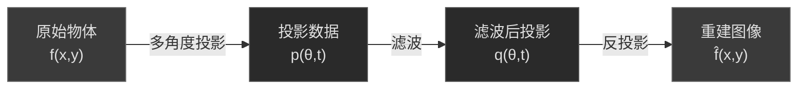
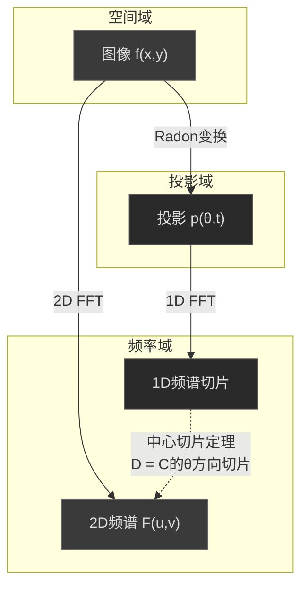
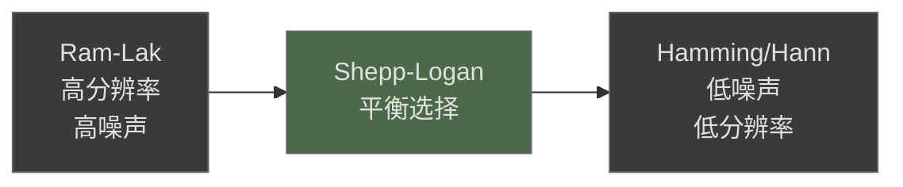
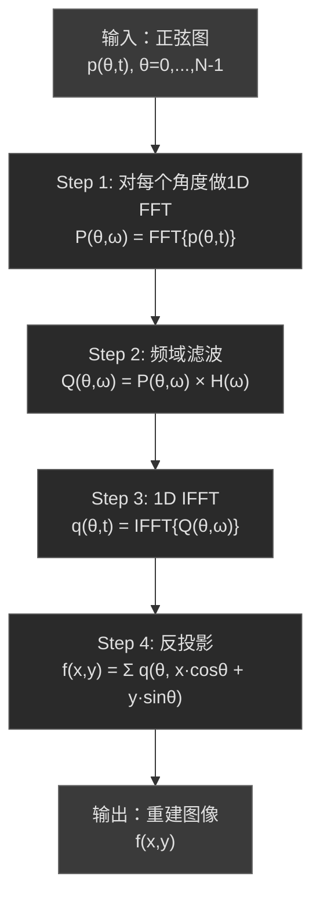
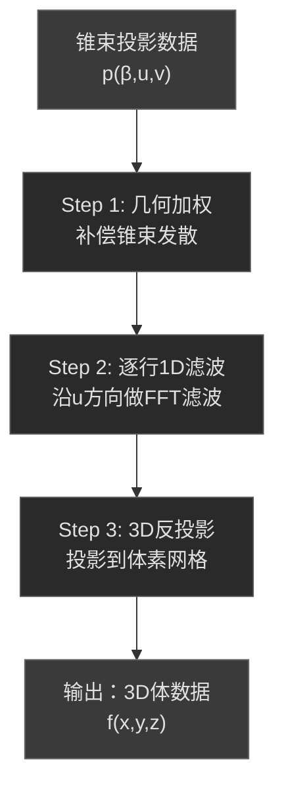
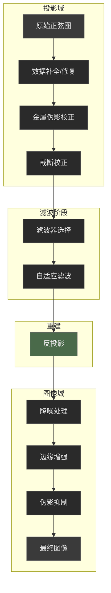
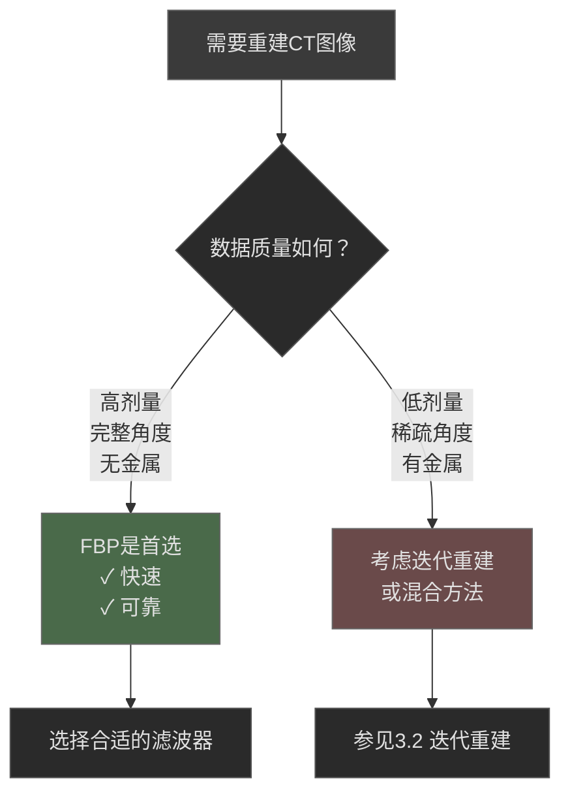

# 3.1 解析重建（FBP/FFT）

> "数学家在1917年就解决了CT重建的理论问题，只是当时没有人知道这个理论有什么用。"
> —— 关于 Johann Radon 与CT重建的历史趣闻

## 🎯 一个跨越半个世纪的数学奇迹

1917年，奥地利数学家约翰·拉东（Johann Radon）在研究纯数学问题时，提出了一个优雅的积分变换——后来被称为**拉东变换（Radon Transform）**。他证明了一个看似抽象的定理：如果知道一个函数沿所有直线的积分值，就可以唯一地恢复这个函数本身。

这个定理在当时被认为只是一个漂亮的数学结果，没有任何实际应用。谁能想到，54年后的1971年，英国工程师豪斯菲尔德（Godfrey Hounsfield）正是利用这个定理，发明了改变医学诊断历史的CT扫描仪！

::: tip 💡 数学与工程的完美邂逅
拉东变换的故事告诉我们：纯数学研究可能在几十年后才展现其实际价值。CT重建是数学理论与工程实践完美结合的典范——数学家提供了"怎么算"，工程师解决了"怎么测"和"怎么快"。
:::

### 从投影到图像：一个直觉的理解

想象你有一个不透明的盒子，里面装着不同密度的物体。你只能用X射线从外面"照射"这个盒子，测量穿过后的X射线强度。

- 从一个角度照射，你只能得到一个"影子"（一维投影）
- 从多个角度照射，你得到多个不同的"影子"
- **关键问题**：能否从这些"影子"反推出盒子内部的结构？

拉东变换和滤波反投影（FBP）给出了肯定的答案：**可以！而且有精确的数学公式。**



---

## 🔬 数学基础：拉东变换与中心切片定理

### 拉东变换的定义

对于二维图像 $f(x,y)$，**拉东变换**定义为沿某一方向的线积分。设直线由角度 $\theta$ 和到原点的距离 $t$ 参数化，则：

$$
\mathcal{R}f(\theta, t) = \int_{-\infty}^{+\infty} f(t\cos\theta - s\sin\theta,\ t\sin\theta + s\cos\theta)\, ds
$$

**物理意义**：
- $\theta$ 是X射线束的方向角（0° 到 180°）
- $t$ 是探测器上的位置（从中心到边缘）
- $\mathcal{R}f(\theta, t)$ 就是沿着角度 $\theta$、偏移量为 $t$ 的那条直线，对 $f(x,y)$ 的线积分

::: info 📐 坐标系的选择
在CT文献中，常见两种坐标系统：
1. **平行束坐标**：$(t, \theta)$，$t$ 是探测器位置，$\theta$ 是角度
2. **扇形束坐标**：$(\gamma, \beta)$，$\gamma$ 是扇形角，$\beta$ 是光源角度

两者可以互相转换，本节主要使用平行束坐标，因为数学推导更清晰。
:::

### 正弦图（Sinogram）：投影的可视化

当我们把所有角度的投影排列成一张二维图像时，就得到了**正弦图（Sinogram）**：

- **横轴**：探测器位置 $t$
- **纵轴**：投影角度 $\theta$（从 0° 到 180°）
- **像素值**：投影值 $p(\theta, t) = \mathcal{R}f(\theta, t)$

**为什么叫"正弦图"？** 

如果原始图像中有一个点状物体位于 $(x_0, y_0)$，它在正弦图中的轨迹是：

$$
t = x_0 \cos\theta + y_0 \sin\theta
$$

这正是一条正弦曲线！所以点状物体在正弦图中表现为正弦波形，这就是"正弦图"名称的由来。

::: tip 💡 正弦图的诊断价值
经验丰富的CT工程师可以直接从正弦图中识别出很多问题：
- **环形伪影**：正弦图中的水平条纹
- **运动伪影**：正弦曲线的不连续或跳变
- **金属伪影**：正弦图中的明亮条带
- **探测器故障**：正弦图中的垂直条纹
:::

### 中心切片定理（傅里叶切片定理）

**中心切片定理**是连接投影域和频率域的桥梁，是FBP算法的理论基础。

**定理陈述**：

投影 $p(\theta, t)$ 对 $t$ 的一维傅里叶变换，等于原始图像 $f(x,y)$ 的二维傅里叶变换在角度 $\theta$ 方向上的"切片"：

$$
\mathcal{F}_1\{p(\theta, t)\}(\omega) = F(\omega\cos\theta, \omega\sin\theta)
$$

其中：
- $\mathcal{F}_1$ 表示对 $t$ 的一维傅里叶变换
- $F(u,v) = \mathcal{F}_2\{f(x,y)\}$ 是原始图像的二维傅里叶变换
- $\omega$ 是频率变量

**直觉理解**：

想象二维频率平面 $(u,v)$。每次从角度 $\theta$ 采集投影，就相当于在频率平面上获得了一条过原点的直线上的数据。当我们从足够多的角度采集投影时，就可以"填满"整个频率平面，然后通过二维逆傅里叶变换恢复原始图像。



::: warning ⚠️ 直接傅里叶重建的问题
理论上，我们可以：(1) 对每个角度的投影做1D FFT；(2) 把结果放到2D频率平面的对应位置；(3) 做2D IFFT得到图像。

但这种"直接傅里叶重建"有严重问题：
- 极坐标采样 → 笛卡尔网格需要插值，引入误差
- 高频区域采样稀疏，低频区域过密
- 插值误差累积导致图像质量差

FBP算法巧妙地避免了这些问题！
:::

---

## 📐 滤波反投影（FBP）算法详解

### 从反投影说起：为什么需要滤波？

最简单的想法是**直接反投影**：把每个投影值"涂回"原来的射线路径上，然后对所有角度求和。

**直接反投影公式**：

$$
f_{\text{BP}}(x,y) = \int_0^{\pi} p(\theta,\ x\cos\theta + y\sin\theta)\, d\theta
$$

但这样得到的结果是**模糊的**！为什么？

**模糊的数学解释**：

可以证明，直接反投影的结果 $f_{\text{BP}}$ 与原始图像 $f$ 的关系是：

$$
f_{\text{BP}}(x,y) = f(x,y) * \frac{1}{r}
$$

其中 $r = \sqrt{x^2 + y^2}$，$*$ 表示卷积。这意味着直接反投影相当于对原始图像做了一个 $1/r$ 的模糊！

**模糊的直觉解释**：

想象一个点状物体。从每个角度看，它的投影都是一条"线"。当我们把所有角度的"线"叠加时，这些线在点的位置相交（正确），但在点的周围也会有残留（错误），形成一个"星芒"状的模糊图案。

::: info 🌟 星芒伪影
直接反投影产生的模糊图案被称为"星芒伪影"（star artifact）。点状物体会呈现出放射状的条纹。这种伪影在角度采样不足时尤其明显。
:::

### FBP：先滤波，再反投影

**核心思想**：在反投影之前，先对投影进行**高通滤波**，补偿 $1/r$ 模糊带来的低频增强。

**FBP重建公式**：

$$
f(x,y) = \int_0^{\pi} \left[ p(\theta, t) * h(t) \right]_{t = x\cos\theta + y\sin\theta}\, d\theta
$$

其中 $h(t)$ 是滤波器的冲激响应，$*$ 表示一维卷积。

**等价的频域形式**：

$$
f(x,y) = \int_0^{\pi} \mathcal{F}^{-1}\left\{ P(\theta, \omega) \cdot H(\omega) \right\}_{t = x\cos\theta + y\sin\theta}\, d\theta
$$

其中 $P(\theta, \omega)$ 是投影的傅里叶变换，$H(\omega)$ 是滤波器的频率响应。

### 斜坡滤波器（Ram-Lak滤波器）

理论上，消除 $1/r$ 模糊所需的**理想滤波器**是：

$$
H_{\text{ideal}}(\omega) = |\omega|
$$

这就是著名的**斜坡滤波器**（Ramp Filter）或**Ram-Lak滤波器**。

**为什么是 $|\omega|$？**

从中心切片定理出发，可以推导出：当从极坐标 $(\omega, \theta)$ 转换到笛卡尔坐标 $(u, v)$ 时，雅可比行列式引入了一个 $|\omega|$ 因子。斜坡滤波器正是补偿这个因子。

**斜坡滤波器的问题**：

$$
h_{\text{ideal}}(t) = \mathcal{F}^{-1}\{|\omega|\} \to \text{不收敛！}
$$

斜坡滤波器在高频无界增长，直接使用会放大高频噪声。实际中必须加窗限制。

::: warning ⚠️ 噪声放大效应
斜坡滤波器是高通滤波器，会放大高频成分。在低剂量CT或高噪声数据中，这会导致重建图像噪声严重。这是FBP算法的固有缺陷，也是迭代重建算法兴起的重要原因之一。
:::

### 常用滤波器设计

为了控制噪声，实际使用的滤波器都是**斜坡滤波器乘以一个窗函数**：

$$
H(\omega) = |\omega| \cdot W(\omega)
$$

| 滤波器名称 | 窗函数 $W(\omega)$ | 特点 |
|-----------|-------------------|------|
| **Ram-Lak** | $\text{rect}(\omega/2\omega_c)$ | 截止频率处硬截断，分辨率最高，噪声最大 |
| **Shepp-Logan** | $\frac{\sin(\pi\omega/2\omega_c)}{\pi\omega/2\omega_c}$ | 轻微平滑，常用于医学CT |
| **Cosine** | $\cos(\pi\omega/2\omega_c)$ | 中等平滑 |
| **Hamming** | $0.54 + 0.46\cos(\pi\omega/\omega_c)$ | 较强平滑，噪声抑制好 |
| **Hann** | $0.5(1 + \cos(\pi\omega/\omega_c))$ | 平滑效果最强，分辨率最低 |

其中 $\omega_c$ 是截止频率，通常取奈奎斯特频率。

**滤波器选择的权衡**：



::: tip 💡 滤波器选择指南
- **高剂量、高对比度场景**（如骨骼成像）：选择 Ram-Lak 或 Shepp-Logan，追求高分辨率
- **低剂量、软组织场景**（如腹部成像）：选择 Hamming 或 Hann，降低噪声
- **胸部CT**：通常使用 Shepp-Logan 作为折中
- **现代CT**：很多厂商提供"锐利"和"平滑"等多种重建核，本质上就是不同的滤波器
:::

### FBP算法的完整流程



**伪代码实现**：

```python
import numpy as np
from numpy.fft import fft, ifft, fftfreq

def fbp_reconstruct(sinogram, angles, filter_type='shepp-logan'):
    """
    滤波反投影重建
    
    Parameters:
    -----------
    sinogram : ndarray, shape (n_angles, n_detectors)
        正弦图数据
    angles : ndarray, shape (n_angles,)
        投影角度（弧度）
    filter_type : str
        滤波器类型
    
    Returns:
    --------
    recon : ndarray, shape (n_detectors, n_detectors)
        重建图像
    """
    n_angles, n_det = sinogram.shape
    
    # Step 1-3: 滤波
    # 构造频率轴
    freq = fftfreq(n_det)
    
    # 构造斜坡滤波器
    ramp = np.abs(freq)
    
    # 应用窗函数
    if filter_type == 'ram-lak':
        filt = ramp
    elif filter_type == 'shepp-logan':
        filt = ramp * np.sinc(freq / 2)
    elif filter_type == 'hamming':
        filt = ramp * (0.54 + 0.46 * np.cos(np.pi * freq))
    elif filter_type == 'hann':
        filt = ramp * 0.5 * (1 + np.cos(np.pi * freq))
    
    # 对每个角度进行滤波
    filtered = np.zeros_like(sinogram)
    for i in range(n_angles):
        proj_fft = fft(sinogram[i])
        filtered[i] = np.real(ifft(proj_fft * filt))
    
    # Step 4: 反投影
    recon = np.zeros((n_det, n_det))
    x = np.linspace(-1, 1, n_det)
    y = np.linspace(-1, 1, n_det)
    X, Y = np.meshgrid(x, y)
    
    for i, theta in enumerate(angles):
        # 计算每个像素对应的探测器位置
        t = X * np.cos(theta) + Y * np.sin(theta)
        # 线性插值
        t_idx = (t + 1) / 2 * (n_det - 1)
        # 反投影累加
        recon += np.interp(t_idx.flatten(), np.arange(n_det), filtered[i]).reshape(n_det, n_det)
    
    return recon * np.pi / n_angles
```

---

## 🌀 扇形束与锥束几何的扩展

### 扇形束FBP

实际的CT扫描仪很少使用平行束几何，而是使用**扇形束**（Fan-beam）几何：X射线从点光源发出，呈扇形照射探测器。

**扇形束到平行束的转换**：

扇形束投影 $p_{\text{fan}}(\beta, \gamma)$ 与平行束投影 $p_{\text{parallel}}(\theta, t)$ 的关系：

$$
p_{\text{parallel}}(\theta, t) = p_{\text{fan}}(\beta = \theta - \gamma,\ \gamma = \arcsin(t/D))
$$

其中 $D$ 是光源到旋转中心的距离，$\gamma$ 是扇形角。

**直接扇形束FBP**：

也可以直接在扇形束几何下推导FBP公式，避免重采样。公式形式类似，但需要额外的几何加权因子：

$$
f(x,y) = \int_0^{2\pi} \frac{D^2}{(D - s)^2} \left[ p_{\text{fan}}(\beta, \gamma) * h(\gamma) \right]_{\gamma = \arctan(t/(D-s))}\, d\beta
$$

::: info 📏 几何加权的物理意义
扇形束中，不同位置的射线路径长度不同，探测器接收到的信号强度也不同。几何加权因子 $D^2/(D-s)^2$ 正是补偿这种差异。
:::

### FDK算法：锥束CT的解析重建

对于三维锥束CT（Cone-beam CT，CBCT），Feldkamp、Davis和Kress在1984年提出了著名的**FDK算法**，是二维FBP向三维的自然扩展。

**FDK算法的基本思想**：

1. **几何加权**：补偿锥束发散带来的信号差异
2. **逐行滤波**：对每个探测器行独立进行一维斜坡滤波
3. **三维反投影**：把滤波后的投影反投影到三维体素网格

**FDK算法流程**：



::: warning ⚠️ FDK的近似性
FDK算法是一个**近似**算法，只有在小锥角（< 10°）时才能获得较好的重建质量。对于大锥角，会出现锥束伪影（cone-beam artifacts），表现为远离中心平面的图像质量下降。

精确的锥束重建需要更复杂的算法，如Katsevich算法（螺旋锥束的精确重建）。
:::

---

## 🔧 投影域到图像域的常用校正/增强算法

FBP算法假设输入的正弦图是"理想"的，但实际数据总是存在各种问题。以下是从投影域到图像域过程中常用的校正和增强算法。

### 投影域校正（重建前）

#### 1. 投影数据补全（Data Completion）

**问题**：由于扫描几何或剂量限制，可能存在角度不完整或探测器缺失。

**方法**：
- **线性插值**：对缺失的投影进行简单插值
- **正弦图修复**：利用正弦图的连续性进行插值
- **基于先验的补全**：利用已知的解剖结构信息

**应用场景**：
- 有限角度重建（limited-angle CT）
- 稀疏角度重建（sparse-view CT）
- 探测器故障数据修复

#### 2. 金属伪影减除（MAR）

**问题**：金属植入物（如假牙、骨钉、人工关节）导致的射线硬化和光子饥饿。

**投影域MAR方法**：


**常用技术**：
- **线性插值MAR（LI-MAR）**：简单但效果有限
- **归一化MAR（NMAR）**：先归一化再插值，效果更好
- **基于先验的MAR**：利用无金属区域的先验信息

#### 3. 截断伪影校正（Truncation Correction）

**问题**：当被扫描物体超出扫描视野（FOV）时，投影数据被截断，导致重建图像边缘出现亮带。

**校正方法**：
- **外推法**：对截断的投影进行平滑外推
- **水等效校正**：假设视野外为水等效组织
- **迭代校正**：先粗略重建，估计视野外区域，再迭代改进

### 滤波器域优化（滤波阶段）

#### 1. 自适应滤波

**思想**：根据局部信号和噪声水平，动态调整滤波器参数。

**实现方式**：
- **噪声自适应**：在高噪声区域使用更平滑的滤波器
- **边缘自适应**：在边缘区域保持锐利滤波器
- **空间变化滤波**：不同位置使用不同的滤波强度

#### 2. 方向自适应滤波

**思想**：考虑投影中的方向信息，在不同方向上使用不同的滤波强度。

**应用**：减少特定方向的条纹伪影，增强特定方向的边缘。

### 图像域后处理（重建后）

#### 1. 边缘增强与锐化

**方法**：
- **反锐化掩模（Unsharp Masking）**：$f_{\text{sharp}} = f + \lambda(f - f_{\text{blur}})$
- **拉普拉斯增强**：$f_{\text{enhanced}} = f - \lambda \nabla^2 f$
- **高频增强滤波**：在频域增强高频分量

::: warning ⚠️ 边缘增强的副作用
过度的边缘增强会放大噪声和产生振铃效应。在医学图像中，应谨慎使用，避免引入虚假的诊断信息。
:::

#### 2. 降噪处理

**经典方法**：
- **高斯滤波**：简单但模糊边缘
- **中值滤波**：保边效果较好
- **双边滤波**：同时考虑空间和灰度距离

**先进方法**：
- **非局部均值（NLM）**：利用图像自相似性
- **BM3D**：基于块匹配的三维变换域降噪
- **深度学习降噪**：如 DnCNN、RED-CNN

#### 3. 伪影抑制

**环形伪影抑制**：
- **极坐标变换法**：转换到极坐标后进行水平滤波
- **小波变换法**：在小波域分离并抑制环形成分

**条纹伪影抑制**：
- **方向滤波**：沿条纹方向进行平滑
- **Sinogram平滑**：在投影域减少条纹来源

### 校正流程总览



---

## 📊 FBP算法的性能特点与局限

### FBP的优势

| 优势 | 说明 |
|-----|------|
| **计算效率高** | 时间复杂度 $O(N^2 \log N)$，适合实时重建 |
| **理论基础扎实** | 有严格的数学推导和收敛性保证 |
| **实现简单** | FFT+反投影，易于硬件加速 |
| **参数少** | 主要参数是滤波器类型，调参简单 |
| **可预测性好** | 给定输入，输出确定，便于质量控制 |

### FBP的局限

| 局限 | 影响 | 应对方案 |
|-----|------|---------|
| **噪声敏感** | 低剂量时图像噪声大 | 迭代重建、深度学习降噪 |
| **数据要求高** | 需要完整角度采样 | 迭代重建、压缩感知 |
| **无法融合先验** | 不能利用解剖知识 | 模型驱动重建 |
| **处理非理想数据能力弱** | 金属伪影、运动伪影难以消除 | 专用校正算法、迭代重建 |

### 何时选择FBP？



---

## 🔑 关键要点总结

1. **拉东变换与FBP的关系**：拉东变换描述了从图像到投影的正向过程，FBP是其逆过程的高效实现。

2. **中心切片定理**：投影的1D傅里叶变换等于图像2D傅里叶变换的径向切片，这是FBP的理论基础。

3. **滤波的必要性**：直接反投影会产生 $1/r$ 模糊，斜坡滤波器正是补偿这个效应。

4. **滤波器选择**：Ram-Lak（高分辨率）→ Shepp-Logan（平衡）→ Hann（低噪声），根据临床需求权衡。

5. **FBP的适用场景**：高剂量、完整采样、对速度要求高的标准CT重建。

6. **校正算法**：投影域（数据补全、MAR、截断校正）+ 图像域（降噪、边缘增强、伪影抑制）可以显著改善FBP重建质量。

---

::: info 💡 下一步学习

FBP是"解析重建"的代表，假设数据完美、模型线性。但现实往往不那么美好：
- 低剂量扫描 → 噪声严重
- 稀疏角度 → 采样不足
- 金属植入物 → 严重伪影

这些情况下，**迭代重建**算法往往能获得更好的结果。下一节我们将介绍SART、OSEM等迭代重建算法，它们把重建问题转化为优化问题，可以灵活地融入物理模型和先验知识。

- 迭代重建（SART/OSEM/正则化）：[3.2 迭代重建](/guide/ch03/02-iterative-recon)
- 深度学习重建（AI4Recon）：[3.3 深度学习重建](/guide/ch03/03-dl-recon)
:::